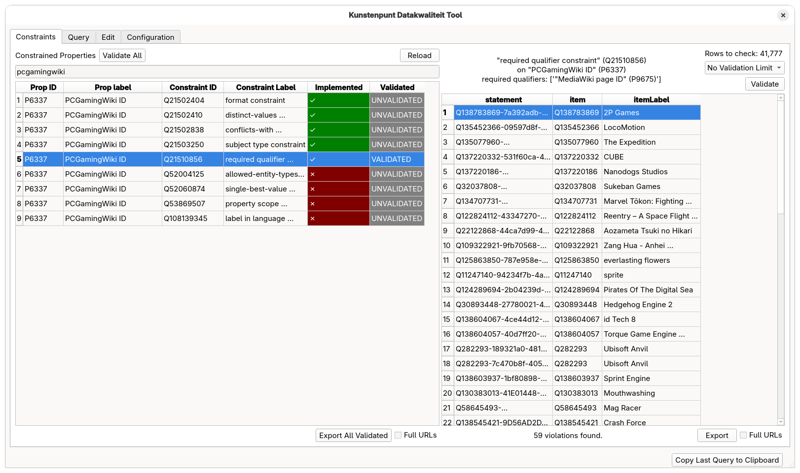

# datakwaliteit-tool

Graphical tool to help improve data quality (_datakwaliteit_ in Dutch) on a wikibase instance.



Some features include:
- Generate a list of all defined constraints on properties
- Ability to validate constraints on properties (user can choose to limit input or output if the query takes to long) (partially implented)
- Generate QuickStatements based on query and template for batch correction of data
- Any Q-number, P-number or statement ID can be double clicked to open the corresponding page in a default web browser.

This tool is initially solely developed for use on the kg.kunsten.be instance, and therefore currently only implements the constraints that are used in this database.

## Current implementation scope

The main focus of this tool is the listing and validation of constraints. This happens through custom SPARQL queries, defined to take the logic for each constraint into account.

The project started out as a practical solution for a specific wikibase instance, so only a limited amount of constraint types is implemented, and even for them, the coverage is not as wide and detailed as how it is defined in the [WikibaseQualityConstraints extension](https://www.mediawiki.org/wiki/Extension:WikibaseQualityConstraints). For example, constraint scopes is currently not implemented, there is no validation on qualifiers or references at the moment... We are slowly working towards feature parity though!

This is at the moment all done by a single volunteer, so progress is moderately paced.

**Constraint implementation status:**

| Constraint Type | Extension Implementation | Basic Validation Implemented |
| - | - | - |
| [allowed qualifiers constraint](https://www.wikidata.org/wiki/Special:MyLanguage/Help:Property_constraints_portal/Qualifiers) | [QualifiersChecker.php](https://gerrit.wikimedia.org/r/plugins/gitiles/mediawiki/extensions/WikibaseQualityConstraints/+/refs/heads/master/src/ConstraintCheck/Checker/QualifiersChecker.php) | ✔️ |
| [allowed units constraint](https://www.wikidata.org/wiki/Special:MyLanguage/Help:Property_constraints_portal/Units) | [AllowedUnitsChecker.php](https://gerrit.wikimedia.org/r/plugins/gitiles/mediawiki/extensions/WikibaseQualityConstraints/+/refs/heads/master/src/ConstraintCheck/Checker/AllowedUnitsChecker.php) |  |
| [allowed-entity-types constraint](https://www.wikidata.org/wiki/Special:MyLanguage/Help:Property_constraints_portal/Allowed_entity_types) | [](https://gerrit.wikimedia.org/r/plugins/gitiles/mediawiki/extensions/WikibaseQualityConstraints/+/refs/heads/master/src/ConstraintCheck/Checker/CitationNeededChecker.php) |  |
| [citation-needed constraint](https://www.wikidata.org/wiki/Special:MyLanguage/Help:Property_constraints_portal/Citation_needed) | [CitationNeededChecker.php](https://gerrit.wikimedia.org/r/plugins/gitiles/mediawiki/extensions/WikibaseQualityConstraints/+/refs/heads/master/src/ConstraintCheck/Checker/CitationNeededChecker.php) |  |
| [Commons link constraint](https://www.wikidata.org/wiki/Special:MyLanguage/Help:Property_constraints_portal/Commons_link) | [CommonsLinkChecker.php](https://gerrit.wikimedia.org/r/plugins/gitiles/mediawiki/extensions/WikibaseQualityConstraints/+/refs/heads/master/src/ConstraintCheck/Checker/CommonsLinkChecker.php) |  |
| [conflicts-with constraint](https://www.wikidata.org/wiki/Special:MyLanguage/Help:Property_constraints_portal/Conflicts_with) | [ConflictsWithChecker.php](https://gerrit.wikimedia.org/r/plugins/gitiles/mediawiki/extensions/WikibaseQualityConstraints/+/refs/heads/master/src/ConstraintCheck/Checker/ConflictsWithChecker.php) | ✔️ |
| [contemporary constraint](https://www.wikidata.org/wiki/Special:MyLanguage/Help:Property_constraints_portal/Contemporary) | [ContemporaryChecker.php](https://gerrit.wikimedia.org/r/plugins/gitiles/mediawiki/extensions/WikibaseQualityConstraints/+/refs/heads/master/src/ConstraintCheck/Checker/ContemporaryChecker.php) |  |
| [description in language constraint](https://www.wikidata.org/wiki/Special:MyLanguage/Help:Property_constraints_portal/Description_in_language) | []() |  |
| [difference-within-range constraint](https://www.wikidata.org/wiki/Special:MyLanguage/Help:Property_constraints_portal/Diff_within_range) | [DiffWithinRangeChecker.php](https://gerrit.wikimedia.org/r/plugins/gitiles/mediawiki/extensions/WikibaseQualityConstraints/+/refs/heads/master/src/ConstraintCheck/Checker/DiffWithinRangeChecker.php) |  |
| [distinct-values constraint](https://www.wikidata.org/wiki/Special:MyLanguage/Help:Property_constraints_portal/Unique_value) | [UniqueValueChecker.php](https://gerrit.wikimedia.org/r/plugins/gitiles/mediawiki/extensions/WikibaseQualityConstraints/+/refs/heads/master/src/ConstraintCheck/Checker/UniqueValueChecker.php) | ✔️ |
| [format constraint](https://www.wikidata.org/wiki/Special:MyLanguage/Help:Property_constraints_portal/Format) | [FormatChecker.php](https://gerrit.wikimedia.org/r/plugins/gitiles/mediawiki/extensions/WikibaseQualityConstraints/+/refs/heads/master/src/ConstraintCheck/Checker/FormatChecker.php) | ✔️ |
| [integer constraint](https://www.wikidata.org/wiki/Special:MyLanguage/Help:Property_constraints_portal/Integer) | [IntegerChecker.php](https://gerrit.wikimedia.org/r/plugins/gitiles/mediawiki/extensions/WikibaseQualityConstraints/+/refs/heads/master/src/ConstraintCheck/Checker/IntegerChecker.php) |  |
| [inverse constraint](https://www.wikidata.org/wiki/Special:MyLanguage/Help:Property_constraints_portal/Inverse) | [InverseChecker.php](https://gerrit.wikimedia.org/r/plugins/gitiles/mediawiki/extensions/WikibaseQualityConstraints/+/refs/heads/master/src/ConstraintCheck/Checker/InverseChecker.php) |  |
| [item-requires-statement constraint](https://www.wikidata.org/wiki/Special:MyLanguage/Help:Property_constraints_portal/Item) | [ItemChecker.php](https://gerrit.wikimedia.org/r/plugins/gitiles/mediawiki/extensions/WikibaseQualityConstraints/+/refs/heads/master/src/ConstraintCheck/Checker/ItemChecker.php) | ✔️ |
| [label in language constraint](https://www.wikidata.org/wiki/Help:Property_constraints_portal/Label_in_language) | [LabelInLanguageChecker.php](https://gerrit.wikimedia.org/r/plugins/gitiles/mediawiki/extensions/WikibaseQualityConstraints/+/refs/heads/master/src/ConstraintCheck/Checker/LabelInLanguageChecker.php) |  |
| [lexeme requires language constraint](https://www.wikidata.org/wiki/Special:MyLanguage/Help:Property_constraints_portal/Lexeme_language) | [Lexeme/LanguageChecker.php](https://gerrit.wikimedia.org/r/plugins/gitiles/mediawiki/extensions/WikibaseQualityConstraints/+/refs/heads/master/src/ConstraintCheck/Checker/Lexeme/LanguageChecker.php) |  |
| lexeme requires lexical category constraint | []() |  |
| lexeme-value-requires-lexical-category constraint | []() |  |
| [multi-value constraint](https://www.wikidata.org/wiki/Special:MyLanguage/Help:Property_constraints_portal/Multi_value) | [MultiValueChecker.php](https://gerrit.wikimedia.org/r/plugins/gitiles/mediawiki/extensions/WikibaseQualityConstraints/+/refs/heads/master/src/ConstraintCheck/Checker/MultiValueChecker.php) |  |
| [no-bounds constraint](https://www.wikidata.org/wiki/Special:MyLanguage/Help:Property_constraints_portal/No_bounds) | [NoBoundsChecker.php](https://gerrit.wikimedia.org/r/plugins/gitiles/mediawiki/extensions/WikibaseQualityConstraints/+/refs/heads/master/src/ConstraintCheck/Checker/NoBoundsChecker.php) |  |
| [none-of constraint](https://www.wikidata.org/wiki/Special:MyLanguage/Help:Property_constraints_portal/None_of) | [NoneOfChecker.php](https://gerrit.wikimedia.org/r/plugins/gitiles/mediawiki/extensions/WikibaseQualityConstraints/+/refs/heads/master/src/ConstraintCheck/Checker/NoneOfChecker.php) |  |
| [one-of constraint](https://www.wikidata.org/wiki/Special:MyLanguage/Help:Property_constraints_portal/One_of) | [OneOfChecker.php](https://gerrit.wikimedia.org/r/plugins/gitiles/mediawiki/extensions/WikibaseQualityConstraints/+/refs/heads/master/src/ConstraintCheck/Checker/OneOfChecker.php) |  |
| one-of qualifier value property constraint | []() |  |
| [property scope constraint](https://www.wikidata.org/wiki/Special:MyLanguage/Help:Property_constraints_portal/Property_Scope_Constraint) | [PropertyScopeChecker.php](https://gerrit.wikimedia.org/r/plugins/gitiles/mediawiki/extensions/WikibaseQualityConstraints/+/refs/heads/master/src/ConstraintCheck/Checker/PropertyScopeChecker.php) |  |
| [range constraint](https://www.wikidata.org/wiki/Special:MyLanguage/Help:Property_constraints_portal/Range) | [RangeChecker.php](https://gerrit.wikimedia.org/r/plugins/gitiles/mediawiki/extensions/WikibaseQualityConstraints/+/refs/heads/master/src/ConstraintCheck/Checker/RangeChecker.php) |  |
| [required qualifier constraint](https://www.wikidata.org/wiki/Special:MyLanguage/Help:Property_constraints_portal/Qualifiers) | [MandatoryQualifiersChecker.php](https://gerrit.wikimedia.org/r/plugins/gitiles/mediawiki/extensions/WikibaseQualityConstraints/+/refs/heads/master/src/ConstraintCheck/Checker/MandatoryQualifiersChecker.php) | ✔️ |
| [single-best-value constraint](https://www.wikidata.org/wiki/Special:MyLanguage/Help:Property_constraints_portal/Single_best_value) | [SingleBestValueChecker.php](https://gerrit.wikimedia.org/r/plugins/gitiles/mediawiki/extensions/WikibaseQualityConstraints/+/refs/heads/master/src/ConstraintCheck/Checker/SingleBestValueChecker.php) |  |
| [single-value constraint](https://www.wikidata.org/wiki/Special:MyLanguage/Help:Property_constraints_portal/Single_value) | [SingleValueChecker.php](https://gerrit.wikimedia.org/r/plugins/gitiles/mediawiki/extensions/WikibaseQualityConstraints/+/refs/heads/master/src/ConstraintCheck/Checker/SingleValueChecker.php) | ✔️ |
| [subject type constraint](https://www.wikidata.org/wiki/Special:MyLanguage/Help:Property_constraints_portal/Subject_class) | [TypeChecker.php](https://gerrit.wikimedia.org/r/plugins/gitiles/mediawiki/extensions/WikibaseQualityConstraints/+/refs/heads/master/src/ConstraintCheck/Checker/TypeChecker.php) | ✔️ |
| [symmetric constraint](https://www.wikidata.org/wiki/Special:MyLanguage/Help:Property_constraints_portal/Symmetric) | [SymmetricChecker.php](https://gerrit.wikimedia.org/r/plugins/gitiles/mediawiki/extensions/WikibaseQualityConstraints/+/refs/heads/master/src/ConstraintCheck/Checker/SymmetricChecker.php) |  |
| [value-requires-statement constraint](https://www.wikidata.org/wiki/Special:MyLanguage/Help:Property_constraints_portal/Target_required_claim) | [TargetRequiredClaimChecker.php](https://gerrit.wikimedia.org/r/plugins/gitiles/mediawiki/extensions/WikibaseQualityConstraints/+/refs/heads/master/src/ConstraintCheck/Checker/TargetRequiredClaimChecker.php) | ✔️ |
| [value-type constraint](https://www.wikidata.org/wiki/Special:MyLanguage/Help:Property_constraints_portal/Value_class) | [ValueTypeChecker.php](https://gerrit.wikimedia.org/r/plugins/gitiles/mediawiki/extensions/WikibaseQualityConstraints/+/refs/heads/master/src/ConstraintCheck/Checker/ValueTypeChecker.php) | ✔️ |

## How to run

The project uses python. Use your preferred method for installing specific python versions on your operating system.

The project makes use of [pipenv](https://pipenv.pypa.io/en/latest/) to manage its python environment. Install it for your platform, then run the following to install the necessary modules:

```pipenv install```

The project uses a fixed python version to have equal development environments. If your installation does not have the correct python version, the previous command will give a warning. Install the correct python version (as indicated by the warning) and try again.

To then run the application, use the following:

```pipenv run python app.py```

If you want to generate a release binary, use `pyside6-deploy` which is part of the used [PySide6](https://wiki.qt.io/Qt_for_Python) Qt UI toolkit library.

```pipenv run pyside6-deploy -c pysidedeploy.spec```

There is also a `Makefile` with commands for compiling the ui files, formatting the code, performing typechecks and tests...

## Configurations
### Configuration for kg.kunsten.be instance
- default language: "nl"
- wikibase url: "https://kg.kunsten.be"
- mediawiki api url: "https://kg.kunsten.be/w/api.php"
- mediawiki index url: "https://kg.kunsten.be/w/index.php"
- mediawiki rest url: "https://kg.kunsten.be/w/rest.php"
- sparql endpoint url: "https://kg.kunsten.be/query/proxy/wdqs/bigdata/namespace/wdq/sparql"
- property constraint pid: "P85"

### Configuration for www.wikidata.org instance
- default language: "en"
- wikibase url: "http://www.wikidata.org"
- mediawiki api url: "https://www.wikidata.org/w/api.php"
- mediawiki index url: "https://www.wikidata.org/w/index.php"
- mediawiki rest url: "https://www.wikidata.org/w/rest.php"
- sparql endpoint url: "https://query.wikidata.org/sparql"
- property constraint pid: "P2302"

## Static type checking
This application uses the `typing` module to add type hints and allows for static type checking using `mypy`.

```mypy --strict --follow-untyped-imports path/to/file.py```

The `--strict` argument enables certain extra strict checking flags. The `--follow-untyped-imports` is needed for now because of the `wikibaseintegrator` module import.